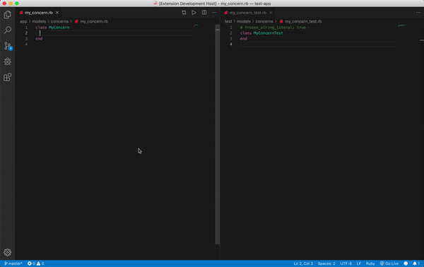
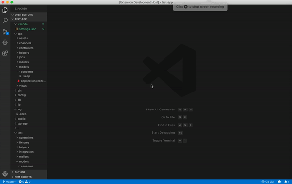

# QAssistant

QAssistant is a VSCode extension that automatically creates test files and scaffolds test cases. The flexible configurations allow support for multiple programming languages (see example configs below).

## Features

Automatically scaffold test cases for new functions, and remove tests for deleted functions:

Automatically create and delete test files:

## Requirements

Does not have any special dependencies.

## Example Extension Configurations:

Ruby: Default configuration is setup for Ruby.

## Extension Settings

QAssistant contributes the following extension settings:

| Setting                                   | Description                                                                                                                                        | Type          | Default                                                                       |
| ----------------------------------------- | -------------------------------------------------------------------------------------------------------------------------------------------------- | ------------- | ----------------------------------------------------------------------------- |
| `qassistant.fileToTestPattern`            | Pattern for files that should have tests scaffolded. (Watch out for infinite loops when using '\*\*')                                              | `string`      | `all/**`                                                                      |
| `qassistant.testFileExtensionReplacement` | Pattern to replace file extension with when creating test file. (Use \$1 for tested file's extension)                                              | `string`      | `_test.$1`                                                                    |
| `qassistant.openTestFileOnCreation`       | Whether QAssistant should open test file in editor on creation.                                                                                    | `boolean`     | `false`                                                                       |
| `qassistant.testFileLocation`             | Where test files should live. Parallel will create a mirrored folder for test files, while adjacent will place tests next to the file its testing. | `string enum` | `parallel` or `adjacent`                                                      |
| `qassistant.testFileHeader`               | Header to include at the top of every test file (eg. helper imports, linter rules, etc).                                                           | `string`      | `# frozen_string_literal: true`                                               |
| `qassistant.testFileSuiteOpening`         | Suite definition at start of test file (use \$? for Pascal case test file name).                                                                   | `string`      | `class $?`                                                                    |
| `qassistant.testFileSuiteClosing`         | Define closing of suite (eg. closing bracket, end, etc).                                                                                           | `string`      | `end`                                                                         |
| `qassistant.newFunctionMatcher`           | Matcher for new function definitions (use \$? to capture the new function's name).                                                                 | `string`      | `def $?`                                                                      |
| `qassistant.newFunctionTemplate`          | Template for new functions (use \$? for function's name).                                                                                          | `string`      | `\ttest('::$? <TEST DESCRIPTION>') do\n\t\t# auto generated test stub\n\tend` |
| `qassistant.testHeaderMatcher`            | Matcher to locate function tests in test file (use \$? for function's name).                                                                       | `string`      | `test\\(['\"]::$? .*?\\) do`                                                  |
| `qassistant.autoDeleteFromTest`           | Whether QAssistant should automatically delete removed functions from test files.                                                                  | `boolean`     | `true`                                                                        |

## Known Issues

No automated tests to verify behavior.

## Release Notes

### 1.0.0

Initial release of QAssistant.
